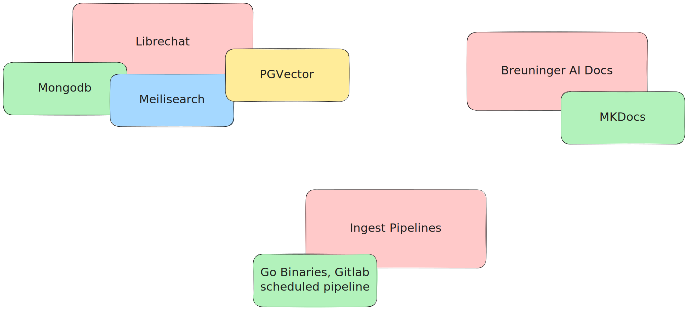
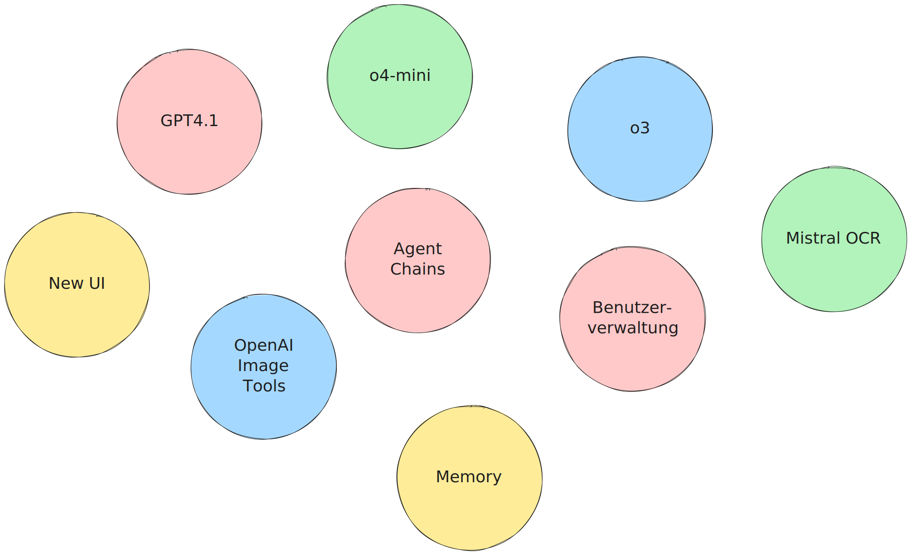

= Breuninger AI
Sascha Schmidt - E. Breuninger GmbH & Co.
:revealjs_theme: white
:customcss: custom.css
:revealjs_history: true
:icons: font
// 20 minutes
:revealjs_totalTime: 1200
:source-highlighter: rogue
:revealjs_transition: slide

:revealjs_width: 1280
:revealjs_html: true
:revealjs_pdfseparatefragments: false

[.notes]
--
* Schön dass ihr hier seid beim Deep-Dive zur Breuninger AI
* Woher kommen wir, wo sind wir, wo wollen wir hin und wie machen wir das eigentlich?
* Ich bin .. / Bei Operations Core Tooling
* Bekannteste Services sind neben der Breuninger AI, die Breuninger ID, Gitlab, Confluence etc.
* Bei Fragen gerne wärend des Vortrags melden, am Ende haben wir aber auch noch Zeit tiefer auf Themen einzugehen
--

== Timeline

--
image::images/timeline.svg[Embedded,1280,opts=inline]
--

[.notes]
--
* April 2024 - AI Hype, Wir brauchten dringend einen AI Chatbot, es sollte günstig sein, SaaS-Lösungen per Seat, PoC, GPT3.5
* Juni 2024 - So können wir es nicht lassen, arbeit an Breuninger AI beginnt
* Juli 2024 - Breuninger AI, Librechat, Internal Guide - HR-Portal, Was kann angebunden werden?
* August 2024 - Referenzen, GPT4o
* Oktober 2024 - Confluence - Public Pages - mit Label, Google
* Dezember 2024 - Dall-E, Confluence Anhänge
* April 2025 - Dashboard, o3-mini, OpenAI tts, Whisper (vorher nur Browser), MCP Model Context Protocol, HR Portal Anhänge
* May 2025 - Evaluate OpenWebUi - Lizenz / Rocketchat
--

== Components

image::images/components.png[Embedded,720]

[.notes]
--
Blick hinter die Kulissen der Breuninger AI
--

== Librechat
--

--

[.notes]
--
* Librechat - Kubernetes
** Mongodb - User, Konversationen, Prompts, etc.
** Meilisearch - Durchsuchbare Konversationen
** PGVector - Lokales RAG (wenn Dokumente hochgeladen werden oder für Agenten)
* Breuninger AI Docs - MKDocs in Pipeline, Nginx Container -> Kubernetes
* Ingest Pipeline - Go Binary, Gitlab Scheduled Pipeline, Change Detection
--

== Azure
--

--

[.notes]
--
* Azure
** Blob Storage - Ingest
** ML Pipelines
*** Blob Storage - Cache
*** Crack - f.e. PDF -> Text
*** Chunk - Text -> Text Chunks -> dass z.b. nicht ein 200 Seitiges Dokument an das LLM übergeben werden muss
*** Embed -> Embedding LLM -> Vektoren
*** Index - Vektoren -> AI Search Index
*** Register - Index -> AI Search
** Azure AI Search
** LLMs (GPT4o, o3-mini, Dall-E)
--

== What's next?

[.notes]
--
* Neue Models: GPT-4.1, o4-mini, o3
* OpenAI Image Tools - Dall-E, nur ohne legastenie
* Neue UI: Auswahl der Agenten wird übersichtlicher
* Agent Chains - mehrere Agents zu einem zusammen bauen, das ist auch Instanzweit Teilbar, allerdings nur für Admins, wenn ihr etwas teilen wollt meldet euch einfach gerne bei uns
* Mistral OCR
* Memory - In einer der nächsten Versionen - z.B. wenn man ein bestimmtes Verhalten haben möchte (Jira Markup als codeblock z.b.)
* User Verwaltung (Gruppen und so) - später dieses Jahr
--

== Usage

[.notes]
--
* 2600 Nutzer
* 200 aktive Nutzer
* 23000 Konversationen
* 80000 Nachrichten

* ChatGPT - 23€/User/Monat -> 60.000€/Monat
* nur die aktiven User ~4500€/Monat

* unsere Kosten belaufen sich im Moment auf ca. 400€ im Monat
* davon 170€ für LLMs
* Custom integration müssten wir auch mit einer SaaS-Lösung bauen
* Das machen wir mit ca. 1/3 Engineer

--

== Questions?

[.notes]
--
Vielen Dank für die Aufmerksamkeit - gibt es noch Fragen?
--

[.columns]
== Links

[.column]
--

https://torvitas.github.io/tcd25-breuninger-ai/
--

[.column]
--
image::images/qr-breuninger-ai.svg[Embedded,360]
https://gitlab.breuni.de/itops/oct/breuninger-ai/
--

